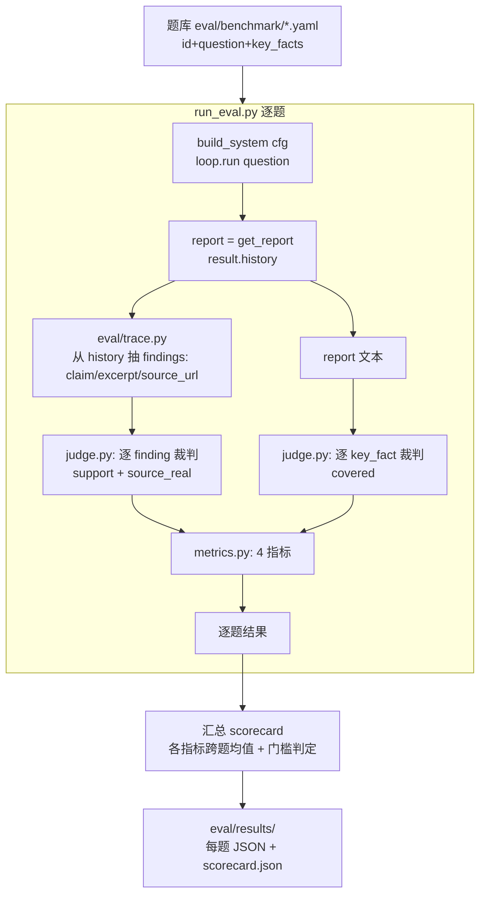

# M3 评估体系(质量 MVP:GLM 逐条裁判 + 4 质量指标)— 设计文档(Spec)

- **日期:** 2026-08-09
- **作者:** 王宇博
- **状态:** Draft,待 review
- **对应整体 spec:** [2026-08-08-deep-research-multi-agent-design.md](2026-08-08-deep-research-multi-agent-design.md) §5(评估体系)
- **前置里程碑:** M1 地基 + M2 四-agent 编排层均合并 main(96 测试绿,M2 真实冒烟通过)

---

## 0. 目标与背景

整体 spec §5 规划了 9 维评估体系(4 质量 + 5 运维)+ 基准集 + 基线对比 + 上线门槛。9 维 + 遥测 + 基线 + 裁判一次性做太大,一个施工图装不下。本 spec 是 **M3 的第一期:质量 MVP**——用 GLM-as-judge 把 4 个**质量**指标跑通,拿到简历头号数字 **Grounding**,并立上线门槛。

**为什么先做质量、不做运维/基线:** 3 个质量指标(Grounding/引用准确率/幻觉率)是**内在指标**——裁判拿报告自带的来源就能判,不依赖人工金标准、也不依赖系统遥测改造;只有覆盖率需要金标准关键事实。运维指标(成本/延迟/自动化率/利用率)要先给 agents/ 全链路加遥测,工作量大且与质量正交,留到 M3 后续。单 agent 基线对比也留到质量 MVP 跑通后(否则没有可对比的主干产物)。

**关键简化(让指标设计大幅变轻):** M2 的 Writer **无工具**(防幻觉硬保证)→ **报告论断 ⊆ 传入 findings**。因此**判定 findings 的 grounding 就等价于判定报告的 grounding**,无需做 "report claim → finding" 的 id 映射(那本会撞跨研究轮次 finding id 冲突的坑)。评估只判 findings + 覆盖率,不碰 report 内部 id。

---

## 1. 里程碑边界(质量 MVP)

**做:**
- `eval/` 模块:trace 抽取 + GLM 逐条裁判 + 4 质量指标 + runner/CLI + 题库格式 + 门槛判定
- 4 质量指标:Grounding / 引用准确率 / 覆盖率 / 幻觉率(定义见 §3)
- GLM-as-judge 逐条裁判(每条 finding 一次、每条关键事实一次;小输出高保真,规避 M2 冒烟踩过的 JSON 解析坑)
- 题库格式 `{id, question, key_facts:[...]}` + 模板 + 少量种子真题(用户填)
- 上线门槛:全集平均 Grounding ≥ `thresholds.grounding_min`(0.85)
- 全 mock TDD + 收尾手动真跑一次(真 GLM + 真题)出真实 scorecard

**不做(留 M3 后续 / M4):**
- 5 运维指标(成本/延迟/Automation Rate/Agent Utilization——需 agents/ 全链路遥测层)
- 单 agent 基线对比(需可切换 baseline 模式)
- 图表 / dashboard(M4 Streamlit)
- 统计显著性、多裁判投票、裁判一致性校准

---

## 2. 架构与数据流

### 2.1 评估管线(逐题)



**零侵入:** 整条评估链路只**消费** `build_system` 的产物(`get_report()` 的 Report + `loop.run()` 返回的 `AgentResult.history`),**不改 `agents/`、`core/`、`llm/`、`tools/`**。findings trace 从 history 里的 `dispatch_research` tool 消息解析得来。

### 2.2 为什么从 history 抽 findings(而非加遥测)

`AgentLoop.run()` 返回 `AgentResult.history`(M1 已有),其中每条 `dispatch_research` tool 消息的 content 是 `{"findings":[{id,claim,source_url,source_title,excerpt,confidence}, ...], "failures":[...]}` 的 JSON 字符串。`eval/trace.py` 遍历 `role=="tool"` 消息、解析出含 `findings` 键的、合并去重(按 claim+source_url),即得全部 findings(含 excerpt)。无需给系统加任何打点。

---

## 3. 指标定义(4 质量 + 附带成功率)

每题先算,再跨题取均值。N = 该题 findings 数,M = 该题 key_facts 数。

| 指标 | 公式 | 裁判来源 |
|---|---|---|
| **Grounding(头号)** | Σ(supported=1, partial=0.5, unsupported=0) / N | 逐 finding 裁判 `support` |
| **引用准确率** | (source_real=true 的 findings) / N | 同一次 finding 裁判顺带判 `source_real` |
| **覆盖率** | (covered=true 的 key_facts) / M | 逐 key_fact 裁判 `covered` |
| **幻觉率** | (support=unsupported **或** source_real=false 的 findings) / N | finding 裁判两个信号合成 |
| 附带 **成功率** | 产出有效 report 的题数 / 总题数 | runner 层(get_report 非 None),免费统计 |

**口径说明:**
- N=0 的题(系统产出报告但抽不到 findings,或全失败):Grounding/引用/幻觉**该题记为不可用**并在 scorecard 标注;成功率照常计入(report 非 None 即算成功产出,但质量分缺失)。
- **门槛:** 全集**平均 Grounding**(只在 N>0 的题上取均值)≥ `thresholds.grounding_min`(0.85)→ "过线"。

### 3.1 关于 "引用准确率" 的 MVP 取舍

整体 spec 原意:报告里的 citations 指向真实存在且支撑的来源的比例(需 report citation → finding 映射)。本 MVP 改为 **finding 层口径**:source_url 是否真实、相关、非编造/死链。依据是 §0 的简化(报告论断 ⊆ findings)。严格 report-citation 层口径留作 M3 后续优化(需先解决跨轮 finding id 冲突)。

---

## 4. 组件职责与文件结构

```
eval/
├── __init__.py
├── benchmark/
│   ├── README.md           # 题库格式说明 + 模板
│   └── <id>.yaml           # 每题:{id, question, key_facts:[...]}(用户填真题;测试用假题)
├── trace.py                # extract_findings(history) -> list[dict]: 从 history 抽 findings
├── judge.py                # GLM 逐条裁判:judge_finding / judge_key_fact(封装 GLMClient)
├── metrics.py              # 4 指标 + 成功率:由裁判 verdict 算分
├── run_eval.py             # 编排 + CLI:跑全集/子集 → scorecard → eval/results/
└── results/                # 输出(每题 .json + scorecard.json),gitignore
```

### 4.1 `eval/trace.py`
- `extract_findings(history: list[dict]) -> list[dict]`:遍历 history,取 `role=="tool"` 消息,content 经清洗+解析(M1 `safe_parse_arguments` + 复用 dispatch 的 `_json_substring` 思路)成 dict;凡含 `findings` 键的,合并其 findings;按 `(claim, source_url)` 去重。返回 `[{id,claim,source_url,source_title,excerpt,confidence}, ...]`。

### 4.2 `eval/judge.py`(核心)
封装 M1 的 `GLMClient`(`llm/glm_client.py`,模型 glm-5.2)。两类裁判,**每次输出极小**(一个 verdict 对象),最大化 JSON 解析成功率:
- `judge_finding(*, claim, excerpt, source_url, client) -> dict`:
  - 给 GLM:`claim` + `excerpt` + `source_url`,问两件事:
    - `support`: `"supported" | "partial" | "unsupported"`(excerpt 是否支撑 claim)
    - `source_real`: `true | false`(source_url 是否真实、相关、非编造/死链)
  - 输出严格 JSON:`{"support":"supported","source_real":true,"reason":"一句依据"}`
- `judge_key_fact(*, key_fact, report_text, client) -> dict`:
  - 给 GLM:`key_fact` + 报告全文,问:报告是否覆盖该关键事实。
  - 输出:`{"covered":true,"reason":"一句依据"}`
- **坏 JSON 兜底:** 用 `safe_parse_arguments` + `_json_substring`(从 `agents.dispatch` 复用/抽公共)清洗;仍失败 → 走 M1 robust 重试,最终失败按 §6 错误处理。
- 裁判 system prompt 集中在 `judge.py` 顶部常量。

### 4.3 `eval/metrics.py`
- `compute_question_metrics(findings_verdicts, key_fact_verdicts, report_produced) -> dict`:纯函数,由 verdict 列表算出该题 5 个数(Grounding/引用/覆盖率/幻觉率/成功)。
- `aggregate(scorecards) -> dict`:跨题均值 + 门槛判定 `passed = mean_grounding >= grounding_min`。
- 无 IO、无 LLM,纯计算 → 易单测。

### 4.4 `eval/run_eval.py`(编排 + CLI)
- `run_one(question, cfg) -> (report, history)`:跑一次系统(可注入 client/search_client 供测试)。
- `evaluate_question(item, cfg, *, judge_client) -> dict`:跑系统 → 抽 trace → 逐条裁判 → 算分 → 返回该题 scorecard。
- `main(argv)`:加载 `eval/benchmark/*.yaml`(`--limit N` / `--only id`)→ 逐题 evaluate → 汇总 → 写 `eval/results/<id>.json` + `scorecard.json`,打印人类可读摘要。组装逻辑都在此,CLI 仅 argv + 渲染。

---

## 5. 测试策略(全 mock,沿用 M1/M2)

| 测试文件 | 覆盖点 |
|---|---|
| `tests/test_trace.py` | 从 canned history(含 dispatch/verify/write tool 消息)正确抽 findings、去重、跳过非 findings 消息 |
| `tests/test_judge.py` | FakeGLMClient(脚本化 verdict)→ judge_finding/judge_key_fact 正确解析;坏 JSON(markdown 围栏/散文包 JSON)被清洗兜底 |
| `tests/test_metrics.py` | 纯函数:canned verdicts → 正确 5 指标;N=0 不可用;门槛判定;跨题均值 |
| `tests/test_run_eval.py` | FakeDeepSeek + FakeSearch + FakeGLM 跑 evaluate_question(不烧 API);report=None 走失败分支;CLI `--limit`/无参 usage |

全部 Fake/Mock,**不烧 API**。收尾**手动真跑**:`python -m eval.run_eval`(真 GLM + 真题),肉眼确认 scorecard 合理即 M3 质量 MVP 收尾。

---

## 6. 错误处理

- **系统产不出报告(report is None):** 该题 success=false,跳过裁判,scorecard 标 `failed: "no_report"`。
- **N=0(有报告但抽不到 findings):** 该题 success=true 但 Grounding/引用/幻觉记 `unavailable`,`reason` 标注;覆盖率仍可算。aggregate 的 Grounding 均值只在 N>0 题上取。
- **裁判输出不可解析:** `safe_parse_arguments` + `_json_substring` 清洗 → 失败则走 M1 robust 重试 → 仍失败:**该条 finding 计为 unsupported(保守,利于精度),该条 key_fact 计为 not covered**;并在 scorecard 计 `judge_parse_failures` 数供观察。
- **GLM 瞬时错误(503/超时/429):** 继承 M1 `robust` 重试层。
- **基准题格式非法:** runner 启动时校验 yaml(id/question/key_facts 齐全),非法题跳过并告警,不中断全集。

---

## 7. Definition of Done

- [ ] `eval/`(trace + judge + metrics + run_eval + benchmark 格式)就位,零侵入 agents/core/llm/tools
- [ ] `pytest -q` 全绿(M1+M2 的 96 保持 + M3 新增,全 mock)
- [ ] `test_metrics.py` 证明 4 指标公式 + 门槛判定正确
- [ ] `test_judge.py` 证明坏 JSON(围栏/散文)被清洗兜底(吸取 M2 冒烟教训)
- [ ] 手动 `python -m eval.run_eval` 真跑出真实 scorecard(Grounding 等有数、门槛判定合理)
- [ ] 题库模板就位、至少 1 道真实种子题(用户填)
- [ ] 可进入 M3 后续(运维指标/基线)

---

## 8. 已知风险 / 后续迭代点

- **裁判自身偏差:** GLM 判 DeepSeek/Researcher 的产出,跨模型已规避 "自评自";但 GLM 仍可能宽松/严格偏。后续可加多裁判投票或一致性校准(M3 后续)。
- **"引用准确率" finding 层口径 vs spec 原意(report citation 层):** 见 §3.1,留作后续(需先解决跨轮 finding id 冲突)。
- **覆盖率依赖关键事实质量:** 金标准关键事实由人写,其质量决定覆盖率指标的上限;种子题需认真写。
- **N=0 边界:** 若系统普遍抽不到 findings(例如 dispatch 全军覆没),Grounding 不可用——这本身是信号,应回 M2 修 "researcher 不收敛"(已知次要根因)。
- **成本:** 真跑一次全集 = 每题一次完整研究(DeepSeek+博查+trafilatura)+ N+M 次 GLM 裁判。种子题控制在 5 道左右以控成本。

---

## Self-Review(spec 作者自检记录)

**1. Spec 覆盖(本里程碑范围内的整体 spec 章节):**
- 整体 spec §5.1 质量指标(4 项)→ §3 指标定义(含 §3.1 引用准确率 MVP 取舍说明)。✅
- 整体 spec §5.3 方法论(基准集 / 门槛 / eval/run_eval.py)→ §2 管线 / §4 组件 / §7 DoD。✅
- 整体 spec §5.2 运维指标 + 基线对比 → §1 明确划为 "不做(留 M3 后续)",scope 收敛。✅

**2. Placeholder 扫描:** 无 TBD/TODO;每个组件有文件 + 函数级落地路径;指标有公式;裁判有 prompt 契约与输出 schema;测试矩阵逐文件对应。

**3. 内部一致性:**
- §0(Writer 无工具 → 报告⊆findings → 判 findings 即判报告)与 §3(指标都在 finding 层)、§4.1(trace 抽 findings)、§3.1(引用准确率 finding 层口径)一致。✅
- §3(N=0 不可用)与 §6(N=0 错误处理)、§4.3(compute_question_metrics 纯函数)一致。✅
- §2.2(从 history 抽 findings,零侵入)与 §1(不改 agents/core)、§4.1、§0 一致。✅

**4. 歧义检查:** "成功率"明确定义为 report 非 None(§3),与运维 "Agent Success Rate"(含质量门槛)区分——后者留 M3 后续,此处附带的成功率只是 runner 层免费统计,口径写明。"过线" 明确为平均 Grounding≥0.85 且只在 N>0 题上取均值(§3)。

**5. Scope 检查:** 聚焦质量 MVP(4 指标 + 裁判 + runner + 门槛),运维/基线/dashboard 明确划出,单个施工图可覆盖。
