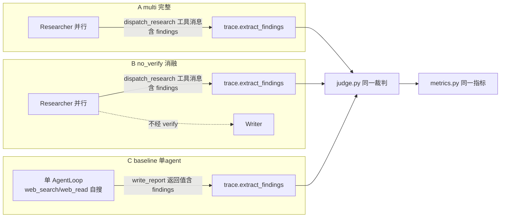

# M3 后续 · 单 Agent 基线对比 + Verifier 消融 — 设计文档(Spec)

- **日期:** 2026-08-12
- **作者:** 王宇博
- **状态:** Draft,待 review
- **对应整体 spec:** [2026-08-08-deep-research-multi-agent-design.md](2026-08-08-deep-research-multi-agent-design.md) §5.3(基线对比)
- **前置里程碑:** M3 质量 MVP 已合并 main(153 测试绿,真实基线 mean_grounding 0.932 过线)

---

## 0. 目标与背景

整体 spec §5.3 要求"基线对比:baseline = 单 agent 无 verifier 版,证明多 agent + verifier 在 Grounding/幻觉率上超越 baseline"。M3 质量 MVP 已把 4 个质量指标 + GLM 裁判 + 5 题基准 + 上线门槛跑通。本 spec 是 **M3 后续的第一期:基线对比**——在同一套 eval 管线上,跑三个配置,拿"超越基线"的实证数字,兑现简历头号卖点。

**为什么先做基线对比、不做运维遥测:** 基线对比只复用已做完的质量指标,**零新基础设施**;运维遥测(成本/延迟/自动化率/利用率)需给 agents/ 全链路加打点,工作量大且与质量正交,作为 M3 后续第二期单独开 spec。

**关键决策(三档而非两档):** spec 原定的"单 agent 基线"同时去掉了 verifier 和多 agent 编排两个变量,A vs C 的差值无法归因。为让"引入 Verifier 的价值"这个故事更硬、更扛质疑,加一个**中间消融 B**(多 agent 去 verifier)。三档对比可分别隔离 verifier 价值(A vs B)与整套架构价值(A vs C)。

**关键简化(让对比零侵入):** 三档配置的 findings 都经 `role=="tool"` 消息产出(`dispatch_research` 或 `write_report` 返回值),`eval/trace.py` 已扫描所有 tool 消息里的 `findings` 键 → **trace / judge / metrics 全通用,零改裁判逻辑**,完全可比。

---

## 1. 里程碑边界

**做:**
- `agents/baseline.py`:`build_baseline_system(cfg)` —— 单决策 agent + 复用 Writer 子例程
- `build_system` / `make_orchestrator` 加 `verify: bool` 参数,`verify=False` 实现消融 B
- `eval/run_eval.py` 加 `--system {multi,no_verify,baseline}` flag + 按 system 分层结果目录
- `eval/compare.py`:加载 N 个 scorecard → 算 Δ → 打印三方对比表 + 写 `comparison.json`
- 手动真跑 3 档 × 5 题 → 真实对比数字
- README 加"基线对比与消融"节

**不做(留 M3 后续 A / M4):**
- 运维指标(成本/延迟/Automation Rate/Agent Utilization——需全链路遥测层)
- 图表 / dashboard(M4 Streamlit)
- 统计显著性、多裁判投票

---

## 2. 三档定义

| 模式 | 构建函数 | Orchestrator 编排 | Verifier | 预算 | 对比含义 |
|---|---|:---:|:---:|---|---|
| **A `multi`**(默认) | `build_system(cfg)` | ✅ 拆解 + 并行 dispatch + 多轮 | ✅ | 现有(config guards) | 完整系统 |
| **B `no_verify`**(消融) | `build_system(cfg, verify=False)` | ✅ 同 A | ❌ | **与 A 严格一致** | A vs B = **Verifier 单独价值** |
| **C `baseline`**(基线) | `build_baseline_system(cfg)` | ❌ 单 agent 自搜自读 | ❌ | **更宽裕**(`baseline_max_steps`) | A vs C = **整套架构价值** |

**公平性策略:**
- **B 与 A 严格等预算**(消融必须只动 verifier 一个变量:同 model、同工具、同 researcher 并行、同 writer、同 prompt 除 verify 步骤外)。
- **C 给更宽裕预算**(`baseline_max_steps` ≥ `agent_max_steps`,且 prompt 无收敛硬预算)——故意不亏待基线,让"多 agent 胜出"抵御"你削弱了基线"的质疑。
- **三档共用:** 同一 DeepSeek 生成模型、同博查 + trafilatura 工具、同 5 题基准、同 GLM-5.2 裁判、同 WRITER_PROMPT(C 的 write_report 复用)。

---

## 3. 架构与数据流

### 3.1 三档 findings 流向(为何 trace 通用)



三档 findings 都以 `{findings:[...]}` 出现在 history 的 `role=="tool"` 消息里:
- A / B:来自 `dispatch_research` 的返回(Researcher 经 dispatch 产出)。
- C:来自 `write_report` 的返回(单 agent 编译后传入,工具回填)。
- `trace.extract_findings` 扫描所有 tool 消息的 `findings` 键、按 `(claim, source_url)` 去重 → **三档同一函数,零分支。**

### 3.2 模式 C:单 agent 基线组件

```
Baseline AgentLoop(name="baseline", system=BASELINE_PROMPT)
├─ web_search          ─┐ 复用 build_web_registry(同博查)
├─ web_read             ─┘
└─ write_report(outline, findings)
     ├─ 内部调 make_writer(复用 WRITER_PROMPT,无工具)→ Report → holder
     └─ 返回 {"findings":[...]} 进 history ← trace 抽取
```

- **单决策 agent**:外层 loop 是唯一控制流(自搜、自读、自编 findings、自决何时收尾)。`write_report` 内部的 Writer 无工具、不做决策,只是"findings→成文"的确定性子例程(类比 `dispatch_research` 内部跑 researcher)→ "单 agent" 定性成立。
- 无 verifier、无 `dispatch_research`(无并行 fan-out)、无 orchestrator 拆解。
- findings 形状与多 agent 一致(`{id,claim,source_url,source_title,excerpt,confidence}`)。
- 接口 `(loop, get_report)` 与 `build_system` 完全一致 → `run_eval.run_one` 只换 build 函数。

### 3.3 模式 B:no_verify 消融

- `build_system(config, *, verify=True, ...)` / `make_orchestrator(..., verify=True)`。
- `verify=False` 时:
  - **不注册** `verify_findings` 工具;
  - orchestrator 用 `NO_VERIFY_ORCHESTRATOR_PROMPT`(= `ORCHESTRATOR_PROMPT` 去掉 verify 步骤:dispatch → 直接 `write_report`,findings 不经复核直通 writer);
  - researcher 并行 dispatch、writer、max_steps、research_max_rounds **全与 A 一致**。
- findings 仍从 `dispatch_research` 抽 → trace 通用。

---

## 4. 组件职责与文件结构

```
agents/
├── baseline.py            # 新:build_baseline_system —— 单 agent + write_report(内嵌 Writer)
├── orchestrator.py        # 改:make_orchestrator 加 verify 参数;verify=False 不注册 verify 工具
├── system.py              # 改:build_system 透传 verify
└── prompts.py             # 加:BASELINE_PROMPT、NO_VERIFY_ORCHESTRATOR_PROMPT

eval/
├── run_eval.py            # 改:--system {multi,no_verify,baseline} + 按 system 选 build fn + 分层 results
├── compare.py             # 新:加载多 scorecard → 算 Δ → 对比表 + comparison.json
└── results/
    ├── scorecard.json         # A multi(现有,保持)
    ├── q00X.json              # A multi(现有)
    ├── no_verify/             # B 消融输出
    └── baseline/              # C 基线输出

tests/
├── test_baseline.py       # 新
├── test_compare.py        # 新
├── test_orchestrator.py   # 扩展:verify=False
└── test_run_eval.py       # 扩展:--system 路由 + 分层目录

config.yaml                # 加:guards.baseline_max_steps(≥ agent_max_steps)
```

### 4.1 `agents/baseline.py`
- `build_baseline_system(config, *, client=None, search_client=None) -> (loop, get_report)`:client/search_client 注入逻辑同 `build_system`。
- `holder` 闭包存 Report;`write_report(outline, findings)` 工具:校验 findings 形状(按项容错,复用 `parse_findings` 思路)→ 调 `make_writer` 生成 Report → 存 holder → 返回 `{"findings": [归一化 findings], "n_sections": N}`(供 trace 抽取 + 给 agent 反馈)。
- 注册 `web_search`/`web_read`(复用 `build_web_registry`)+ `write_report`。
- `max_steps = config["guards"].get("baseline_max_steps", agent_max_steps)`。

### 4.2 `agents/orchestrator.py`(改)
- `make_orchestrator(..., verify: bool = True)`:verify=False 时不注册 `verify_findings`,system_prompt 用 `NO_VERIFY_ORCHESTRATOR_PROMPT`,`_dispatch_research` / `_write_report` 不变。

### 4.3 `agents/prompts.py`(加)
- `BASELINE_PROMPT`:你是单人研究员,用 web_search/web_read 研究整个问题,按 RESEARCHER 铁律(claim⊆excerpt、严格不改写、source_url 真实访问过)编结构化 findings,然后调 `write_report(outline, findings)` 提交。无收敛硬预算(对应宽裕)。
- `NO_VERIFY_ORCHESTRATOR_PROMPT`:`ORCHESTRATOR_PROMPT` 去掉 verify_findings 工具与第 2 步,改成 dispatch 后直接 write_report。

### 4.4 `eval/run_eval.py`(改)
- `main()` 加 `--system {multi,no_verify,baseline}`(默认 `multi`)。按值选 `build_fn`:`multi`→`build_system`,`no_verify`→`lambda cfg,**kw: build_system(cfg, verify=False, **kw)`,`baseline`→`build_baseline_system`。透传给 `run_one`(沿用现有 `run_one_fn` 注入式风格,可测)。
- 结果目录:默认 `eval/results/`(`multi`);`no_verify`→`eval/results/no_verify/`;`baseline`→`eval/results/baseline/`。各写自己的 `scorecard.json` + 逐题 JSON。
- 默认 `multi` → 现有命令行与已提交基线**零影响**。

### 4.5 `eval/compare.py`(新)
- `compare(scorecards: dict[str, dict]) -> dict`:入参 `{system名: scorecard}`,算两两 Δ(默认报告 A−B、A−C)。纯函数。
- `render_table(cmp) -> str`:人类可读对比表(指标 / A / B / C / ΔA−B / ΔA−C)+ 结论行。
- CLI:`python -m eval.compare [--systems multi,no_verify,baseline] [--results-dir eval/results]` → 打印表 + 写 `comparison.json`。
- **诚实规则:** 任一指标基线/消融反超时照实报,不挑数。

---

## 5. 测试策略(全 mock,沿用 M1/M2/M3)

| 测试文件 | 覆盖点 |
|---|---|
| `tests/test_baseline.py`(新) | FakeDeepSeek 脚本化 web_search→web_read→write_report → ① Report 产出 ② `extract_findings(history)` 抽到 findings(**trace 通用**)③ verifier 未参与 ④ `report=None` 路径 ⑤ `baseline_max_steps` 生效 |
| `tests/test_orchestrator.py`(扩) | `verify=False`:不注册 `verify_findings`、findings 直通 writer、其余与 A 一致(**只动一个变量**) |
| `tests/test_run_eval.py`(扩) | `--system no_verify/baseline` 路由正确 build fn(注入 fake)、结果写到对应子目录;`--system multi`(默认)行为不变 |
| `tests/test_compare.py`(新) | canned 三 scorecard → Δ(A−B、A−C)算对 + 结论文案;**基线反超时照实报** |

全 Fake/Mock,**不烧 API**。收尾手动真跑 3 档 × 5 题。

---

## 6. 错误处理

- **report=None:** 三档统一 → `success=false`,跳过裁判(现有)。
- **N=0(有报告抽不到 findings):** grounding/引用/幻觉记 unavailable(现有)。
- **C 特有 —— write_report 收畸形 findings:** 按项跳过(复用 `parse_findings` 容错);C 无 `research_max_rounds`(单 agent 在 `baseline_max_steps` 内自决)。
- **B 特有 —— verifier 缺席:** findings 含弱/不支撑项直通 writer,正是要测的效果,不兜底(否则消融失效)。
- **成本:** 真跑 = 3 × 现有单次全集(DeepSeek + 博查 + GLM 裁判)。5 题规模可控。

---

## 7. Definition of Done

- [ ] `build_baseline_system` + `verify=False` 消融 + `eval/compare.py` 就位,**零改 judge/metrics/trace**
- [ ] `pytest -q` 全绿(现有 153 + 新增,全 mock)
- [ ] `test_baseline` 证明 findings 经同一 `trace` 可抽、verifier 缺席、report=None 分支
- [ ] `test_orchestrator` 证明 `verify=False` 只动 verifier 一个变量
- [ ] `test_compare` 证明 Δ 数学正确 + 诚实报数(反超照实)
- [ ] 手动真跑 3 档 × 5 题 → `comparison.json` + 三方对比表,数字合理
- [ ] README 加"基线对比与消融"节(Verifier 价值 + 架构价值的头号结论)
- [ ] 可进入 M3 后续 A(运维遥测)

---

## 8. 已知风险 / 后续迭代点

- **样本量小(5 题):** Δ 的统计显著性不足;结论是"趋势性证据"而非统计证明。后续可扩题库到 20-30 题(整体 spec §5.3 目标)。
- **C 的"单 agent"定性:** write_report 内嵌 Writer 子例程,严格说是"单决策 agent + 确定性成文子例程"。面试讲述时按"唯一控制流 agent"解释;若被深究,可后续把 Writer 并入单 agent(牺牲复用与 findings/报告分离)。
- **三档共享研究员式 findings 编译:** C 的单 agent 按 RESEARCHER 铁律编 findings,与多 agent 的 Researcher 同源 → 对比的是"编排 + verifier",而非"编 findings 的能力",这是有意为之的公平点。
- **成本:** 3 × 全集真跑费用;若需控成本可先 `--limit 3` 跑趋势。
- **A(运维遥测)留下一期:** 延迟/成本/利用率需全链路打点,本 spec 不含。

---

## Self-Review(spec 作者自检记录)

**1. Spec 覆盖(本里程碑范围内的整体 spec 章节):**
- 整体 spec §5.3 基线对比(baseline = 单 agent 无 verifier)→ §0/§2/§3(C 模式)。✅
- 加消融 B(本 spec 决策)→ §0 决策说明 + §2 三档定义 + §3.3。✅
- 对比维度限定质量 5 维(本 spec 决策,延迟/成本留给 A)→ §1 不做项。✅

**2. Placeholder 扫描:** 无 TBD/TODO;三档各有构建函数级落地;findings 流向有图;对比有公式与诚实规则;测试矩阵逐文件对应;DoD 可勾。

**3. 内部一致性:**
- §0(trace 扫所有 tool 消息的 findings 键 → 三档通用)与 §3.1(三档 findings 流向图)、§4(trace/judge/metrics 零改)一致。✅
- §2(B 与 A 等预算、C 更宽裕)与 §3.3(B 全与 A 一致)、§4.1(C 用 baseline_max_steps)一致。✅
- §3.2(C 单决策 agent + Writer 子例程)与 §0/§8(定性说明与风险)一致。✅

**4. 歧义检查:** "单 agent" 明确定义为"唯一决策/控制流 agent"(§3.2、§8);"对比含义"逐档写明(§2);"诚实规则"明确反超照实报(§4.5);"宽裕预算"明确 B 等额、C 更高(§2)。

**5. Scope 检查:** 聚焦基线对比(三档 build + eval flag + compare + README),运维遥测/dashboard 明确划出,单个施工图可覆盖。
