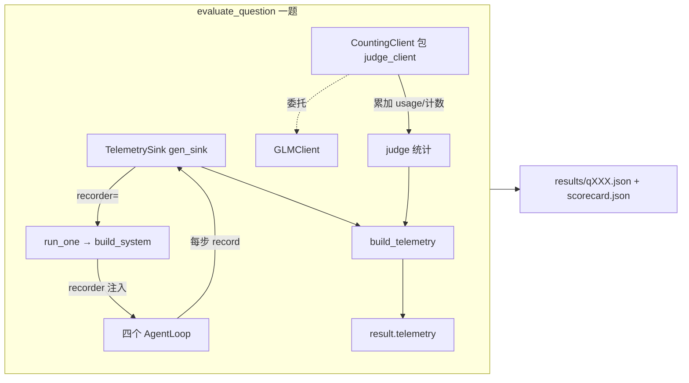

# M3 后续 · 运维遥测(延迟/成本/利用率)— 设计文档(Spec)

- **日期:** 2026-08-13
- **作者:** 王宇博
- **状态:** Draft,待 review
- **对应整体 spec:** [2026-08-08-deep-research-multi-agent-design.md](2026-08-08-deep-research-multi-agent-design.md) §5.2(运维指标:延迟/成本/利用率)
- **前置里程碑:** M3 后续第一期(基线对比 + verifier 消融)已合并 main `8173a3c`(180 测试绿,三档 A/B/C 对比就位)

---

## 0. 目标与背景

整体 spec §5.2 要求运维可观测:延迟(latency)、成本(cost)、利用率(utilization)。基线对比 spec 已明确把这一块划为"M3 后续第二期",理由是"需给 agents/ 全链路加打点,工作量大且与质量正交"。本 spec 兑现这最后一期。

**服务目标(决定做多重):** 本期遥测是**作品集/简历展示物**——每次 eval run 产出一份干净的运维指标报告,能在 README 与简历写"我给多 agent 系统做了运维可观测(延迟/成本/利用率三柱)"。**一次性产物,不做持续追踪/时间序列/Prometheus。** 因此走最轻量路线:一个内存 sink + JSON 产物 + 控制台表,零外部依赖。

**利用率口径(本 spec 决策):** 多 agent 系统里 utilization 有多种解读(并发利用率/步数效率/工具结构/token 效率)。本期取 **agent 步数效率**——各 agent 实际步数 vs `max_steps` 上限,故事是"收敛快、预算不浪费"。其余口径(并发吃满度、工具调用结构、token 效率)留后续,本期不混入。

**顺带修一个现成 bug:** `core/agent_loop.py:68` 的 `AgentResult.usage` 只保留**最后一步**的 usage,多步 agent(典型 researcher 跑 4-5 步)漏算约 4/5 的 token。遥测要算准成本必须先修它——本期埋点顺手修。

**两个关键现成基础(埋点面小):**
1. **单一 LLM 收口** `OpenAICompatClient.chat()`——生成 + 裁判全走这一个方法,`LLMResponse.usage` 每调用都已带 `{prompt_tokens, completion_tokens}`。
2. **`AgentLoop` 是唯一执行原语**,自带 `.name`(orchestrator/researcher/verifier/writer/baseline)——天然的 agent 归因标签。

---

## 1. 里程碑边界

**做(核心):**
- 新增 `core/telemetry.py`:`TelemetrySink`(线程安全)+ `CountingClient`(裁判专用计数包装)+ 纯函数 `compute_cost` / `aggregate_telemetry`。
- `core/agent_loop.py`:`AgentLoop` 加 `recorder` 注入;`run()` 累加各步 token(**修 usage 漏算**)+ 计步 + `perf_counter` 计墙钟;收敛与触顶都上报。
- `agents/{system,orchestrator,researcher,verifier,writer,baseline}.py`:各 `make_*` / build 函数加 `recorder=None` 透传。
- `eval/run_eval.py`:`run_one` 建 sink 注入;`evaluate_question` 用 `CountingClient` 包 judge_client + 计裁判墙钟;逐题结果 JSON 加 `telemetry` 字段;`scorecard.json` 加聚合;控制台加遥测表。
- `config.yaml`:新增 `pricing` 段(USD/1M tokens,注明截至 2026-08 公开标价·近似·可调)。
- 全套 mock 测试 + README 加"运维遥测"节。
- **真跑 multi 5 题**(中等档)→ 把真实 telemetry(单题成本/总墙钟/researcher平均步数)填进 README 当样例;可先 `--limit 3` 验证量级再全跑。

**不做(留后续):**
- compare.py 的遥测 Δ(多 agent vs baseline 成本/墙钟/步数对比)——架构价值故事现有质量 `comparison.json` 已讲(Grounding Δ +0.089),本期不重复。
- 三档遥测对比真跑(15 题)、持续监控 / 时间序列 / dashboard(M4 Streamlit)/ 统计显著性。

---

## 2. 三柱指标定义

| 柱 | 指标 | 口径 | 产出层级 |
|---|---|---|---|
| **延迟 latency** | `wall_s` | 墙钟秒。分三级:`eval_wall_s`(整批)、`per_question_wall_s`(单题)、`per_agent.wall_s`(单 agent 角色;researcher 按单个计,不叠加并发) | 单题 + 汇总 |
| **成本 cost** | `cost_usd` | `tokens/1e6 × price_per_1m`(input/output 分计)。**产品链路(generator,DeepSeek)与评估链路(judge,GLM)分列**——spec §5.2③ 要求,也是简历好故事("单题产品成本 \$X,评估开销 \$Y") | 单题 + 汇总 |
| **利用率 utilization** | `budget_used = steps / max_steps` | 各 agent 角色实际步数 vs 上限(researcher 理想 4-5 / 上限 6);附 `hit_max` 触顶(Escalation)次数。**低 = 收敛快** | 单题 + 汇总 |

**成本单价(config.yaml `pricing` 段,USD/1M tokens):**

```yaml
pricing:                       # 成本估算单价(USD/1M tokens);公开标价·截至 2026-08·近似·可调
  deepseek:                    # deepseek-chat = V4-Flash;取 cache-miss(保守,不假设命中)
    input_per_1m: 0.14         #   来源 api-docs.deepseek.com/quick_start/pricing
    output_per_1m: 0.28
  glm:                         # GLM-5.2 实标未公开,暂按同族 GLM-4.5(¥2/¥8 per 1M)@7.2 换算
    input_per_1m: 0.28         #   实现时核对 5.2 实标后更新;bigmodel.cn/pricing
    output_per_1m: 1.12
```

`compute_cost(prompt_tokens, completion_tokens, pricing_for_model) -> float` 纯函数。缺 `pricing` 段时成本记 `None`(指标里的 token 仍准),不崩。

---

## 3. 架构与数据流

### 3.1 总览:一题一个 sink,两个埋点



- **生成链路埋点 = AgentLoop**:一处覆盖四柱 agent 的 token(聚合)+ 步数 + 墙钟 + 触顶。
- **裁判链路埋点 = CountingClient**:委托内层 GLMClient、Lock 下累加 usage 与调用次数,零改 judge 契约。
- sink 生命周期 = 一题。题间并发时各题独立 sink,互不污染。

### 3.2 数据流(单题)

```
evaluate_question(item):
  gen_sink = TelemetrySink()
  report, history = run_one(q, cfg, ..., recorder=gen_sink)   # AgentLoop 各步 → gen_sink.record(...)
  gen_rollup = gen_sink.aggregate_by_name()                    # {name → {n, total_steps, max_steps, tokens, wall_s, hit_max}} 按 name 卷起

  jc = CountingClient(judge_client); t0 = perf_counter()
  findings/key_facts 裁判并发(judge_finding/judge_key_fact 用 client=jc)
  judge_wall = perf_counter() - t0
  judge_stat = jc.snapshot()                                   # {calls, prompt_tokens, completion_tokens}

  telemetry = build_telemetry(gen_snapshot, judge_stat, judge_wall, pricing, question_wall_s)
  result["telemetry"] = telemetry
```

### 3.3 AgentLoop 埋点(覆盖三柱 + 修 usage bug)

```
AgentLoop.run(user_message):
  start = perf_counter()
  total_prompt = total_completion = 0
  for step in 1..max_steps:
      resp = client.chat(...)
      total_prompt  += resp.usage.get("prompt_tokens", 0)      # ← 累加(原 bug:只留末步)
      total_completion += resp.usage.get("completion_tokens", 0)
      ... 执行工具 / 回填 ...
      if 无 tool_call:                                          # 收敛
          _record(step, total_prompt, total_completion, hit_max=False)
          return AgentResult(..., usage={聚合})                 # ← AgentResult.usage 改聚合值
  _record(max_steps, total_prompt, total_completion, hit_max=True)   # 触顶
  raise Escalation(...)                                        # sink 已先记,不丢

_record: 若 self.recorder 非 None → recorder.record(AgentRecord(name, steps, max_steps, tokens, wall_s, hit_max))
```

- `recorder=None`(默认)时除 `usage 改聚合`外行为不变 → **向后兼容**(单步场景聚合值 == 末步值,既有断言不破;多步场景的测试在 §5 补)。

---

## 4. 组件职责与文件结构

```
core/
├── telemetry.py            # 新:TelemetrySink + AgentRecord + CountingClient + compute_cost + aggregate_telemetry + build_telemetry
└── agent_loop.py           # 改:__init__ 加 recorder;run() 累加 token/计步/计墙钟/上报;AgentResult.usage 聚合

agents/
├── system.py               # 改:build_system 加 recorder=None,透传给 make_orchestrator + 三个 _run_* 闭包
├── orchestrator.py         # 改:make_orchestrator 加 recorder=None → AgentLoop(recorder=...)
├── researcher.py           # 改:make_researcher 加 recorder=None → AgentLoop
├── verifier.py             # 改:make_verifier 加 recorder=None → AgentLoop
├── writer.py               # 改:make_writer 加 recorder=None → AgentLoop
└── baseline.py             # 改:build_baseline_system 加 recorder=None → AgentLoop

eval/
└── run_eval.py             # 改:run_one 建 sink 注入;evaluate_question 包 CountingClient + 计裁判墙钟 + 组装 telemetry;scorecard 加聚合;_print_summary 加遥测表

config.yaml                 # 加:pricing 段
tests/
├── test_telemetry.py       # 新:sink 线程安全 / compute_cost / CountingClient / aggregate_telemetry / build_telemetry
└── test_agent_loop.py(扩)  # 多步聚合 token;recorder 上报收敛与触顶;recorder=None 向后兼容
└── test_run_eval.py(扩)   # 逐题结果含 telemetry 字段;scorecard 聚合;judge 计数正确
```

### 4.1 `core/telemetry.py`

- **`AgentRecord`**(dataclass):`name, n(同角色实例数,默认1), steps, max_steps, prompt_tokens, completion_tokens, wall_s, hit_max`。
- **`TelemetrySink`**:`__init__` 持 `threading.Lock` + `list[AgentRecord]`;`record(AgentRecord)` 线程安全 append;`snapshot() -> list[dict]`(深拷贝,防外部改);`aggregate_by_name() -> dict[name, 卷起统计]`(researcher 多实例合到一处:`n`、`total_steps` 求和、tokens 求和、`wall_s` 取均值、`hit_max` 求和)。
- **`CountingClient(LLMClient)`**:`__init__(inner)`;`chat(**kw)` 委托内层、Lock 下 `calls+=1`、累加 `resp.usage`;`snapshot() -> {calls, prompt_tokens, completion_tokens}`;`reset()`。
- **`compute_cost(prompt_tokens, completion_tokens, pricing_model) -> float | None`**:`(pt/1e6)*in + (ct/1e6)*out`;pricing 缺失返回 None。
- **`aggregate_telemetry(per_question_telemetries, pricing) -> dict`**:跨题均值(单题成本/墙钟/各 agent mean_steps/budget_used)+ 总成本。
- **`build_telemetry(gen_rollup, judge_stat, judge_wall_s, question_wall_s, pricing) -> dict`**:组装单题 `telemetry` 字段(见 §4.4 schema)。`gen_rollup` = `sink.aggregate_by_name()` 的输出。

### 4.2 `core/agent_loop.py`(改)

- `__init__(..., recorder: "TelemetrySink | None" = None)`。
- `run()`:按 §3.3 累加 token、计步、`perf_counter` 计墙钟;`AgentResult.usage` 返回聚合 `{prompt_tokens, completion_tokens}`(替代末步)。
- 私有 `_record(...)`:recorder 非 None 时构造 `AgentRecord` 上报;收敛(return)与触顶(raise Escalation 前)两条路径都调。

### 4.3 `eval/run_eval.py`(改)

- `run_one(question, cfg, *, client, search_client, system, recorder=None)`:把 `recorder` 透传给 `build_fn`。
- `evaluate_question`:
  - 建 `gen_sink = TelemetrySink()`;`runner` 默认路径传 `recorder=gen_sink`(注入式 `run_one_fn` 路径下 sink 保持空,telemetry 为最小/空,不影响质量指标测试)。
  - 整题 `perf_counter` 计 `question_wall_s`。
  - `jc = CountingClient(judge_client)`;裁判并发用 `client=jc`;计 `judge_wall_s`。
  - `result["telemetry"] = build_telemetry(gen_sink.aggregate_by_name(), jc.snapshot(), judge_wall_s, question_wall_s, cfg.get("pricing"))`。
- `main()`:整批 `perf_counter` 计 `eval_wall_s`;`scorecard["telemetry"] = aggregate_telemetry([...], pricing)`;`_print_summary` 后打遥测表(总墙钟 / 总成本 gen|judge|total / 各 agent mean_steps·budget_used)。

### 4.4 单题 `telemetry` schema

```jsonc
"telemetry": {
  "wall_s": 42.3,                              // 单题墙钟
  "generator": {                               // 产品链路(DeepSeek)
    "by_agent": [
      {"name":"orchestrator","n":1,"steps":2,"max_steps":12,
       "prompt_tokens":1200,"completion_tokens":300,"wall_s":3.1,"hit_max":0},
      {"name":"researcher","n":3,"total_steps":12,"max_steps":6,
       "prompt_tokens":8000,"completion_tokens":1500,"wall_s":18.2,"hit_max":0},
      {"name":"verifier","n":1,"steps":3,"max_steps":12,"prompt_tokens":2000,"completion_tokens":400,"wall_s":5.0,"hit_max":0},
      {"name":"writer","n":1,"steps":1,"max_steps":12,"prompt_tokens":1500,"completion_tokens":1200,"wall_s":2.5,"hit_max":0}
    ],
    "totals": {"prompt_tokens":12700,"completion_tokens":3400,"cost_usd":0.0027}
  },
  "judge": {"calls":27,"prompt_tokens":9000,"completion_tokens":800,"wall_s":6.1,"cost_usd":0.0030},
  "cost_usd": {"generator":0.0027,"judge":0.0030,"total":0.0057},   // 产品 vs 评估 分列
  "utilization": {
    "researcher":{"mean_steps":4.0,"max_steps":6,"budget_used":0.67,"hit_max":0},
    "orchestrator":{"mean_steps":2.0,"max_steps":12,"budget_used":0.17,"hit_max":0}
  }
}
```

> reporter/verifier 等单实例 agent 的 utilization 同样产出(`mean_steps==steps`);上表为省略。`cost_usd` 任一为 None(pricing 缺失)时该键为 null,token 仍准。

---

## 5. 测试策略(全 mock,沿用 M1/M2/M3)

| 文件 | 覆盖点 |
|---|---|
| `tests/test_telemetry.py`(新) | ① `TelemetrySink` 并发 record(N 线程)不丢不乱、`aggregate_by_name` 多实例正确卷起;② `compute_cost` 换算对、pricing 缺失返回 None;③ `CountingClient` 委托返回值不变 + 并发累加正确;④ `aggregate_telemetry` 跨题均值/总成本对;⑤ `build_telemetry` schema 字段齐、cost 分列对 |
| `tests/test_agent_loop.py`(扩) | ① 多步 agent(脚本化 FakeClient 走 3 步)→ `AgentResult.usage` 为**三步之和**(修 bug 的核心断言);② 收敛路径 recorder 记一条 `hit_max=False`;③ 触顶路径(步数用尽)recorder 记 `hit_max=True` 后仍 raise Escalation;④ `recorder=None` 时行为除 usage 聚合外不变 |
| `tests/test_run_eval.py`(扩) | ① `evaluate_question` 产物含 `telemetry` 字段且字段齐(FakeClient/FakeGLM 注入);② judge 调用次数 == `telemetry.judge.calls`;③ `scorecard["telemetry"]` 聚合正确;④ `report=None` 路径 telemetry 仍可产出(空 generator)不崩 |
| 现有 usage 测试 | 随 `AgentResult.usage` 改聚合后同步更新(单步场景天然不变,多步场景补断言) |

全 Fake/Mock,**不烧 API**。真跑(若纳入)放 DoD 末尾。

---

## 6. 错误处理

- **pricing 缺失:** `compute_cost` 返回 None;`cost_usd.*` 为 null;token 与延迟/利用率仍准。不崩、不阻断 eval。
- **recorder=None(默认):** AgentLoop 不上报,`telemetry.generator` 为空 → 旧调用方(非 eval,如 `main.py` 单跑)零影响。
- **触顶(Escalation):** recorder 在 raise 前已记 `hit_max=True`;Escalation 照常向上传播(单题兜底现有逻辑不变),telemetry 仍随失败题写入。
- **judge 异常:** 现有单题兜底 catch;CountingClient 已记的部分调用仍进 `jc.snapshot()`(若 eval 在 catch 前已组装则随失败题写入,否则 telemetry 缺 judge 段,不崩)。
- **线程安全:** sink 与 CountingClient 均 Lock 保护;题间并发各题独立 sink;judge 并发共享同一 CountingClient(其 Lock 保护累加)。
- **report=None:** generator telemetry 为空,不参与 aggregate_telemetry 的均值分母(与现有 `grounding_questions` 有效题口径一致)。

---

## 7. Definition of Done

- [ ] `core/telemetry.py` 就位(sink + CountingClient + 纯函数),`AgentLoop` 注入 recorder + 修 usage 聚合
- [ ] 各 `make_*` / build 函数透传 `recorder`
- [ ] `run_eval` 逐题 `telemetry` 字段 + `scorecard` 聚合 + 控制台遥测表
- [ ] `config.yaml` `pricing` 段(GLM-5.2 实标已核对或注明参考)
- [ ] `pytest -q` 全绿(现有 + 新增,全 mock)
- [ ] `test_telemetry` / `test_agent_loop` 扩 / `test_run_eval` 扩 覆盖 §5 全部点
- [ ] README 加"运维遥测"节(三柱口径 + 方法论 + 单点埋点设计 + 成本估算说明)
- [ ] **真跑 multi 5 题** → README "运维遥测"节填入真实 telemetry 样例(单题成本/总墙钟/researcher平均步数);先 `--limit 3` 验证量级

---

## 8. 已知风险 / 后续迭代点

- **样本量小(5 题):** 成本/延迟是点估计,简历讲述按"方法论 + 量级"而非精确值;真跑数字注明题量与日期。
- **GLM-5.2 定价未公开:** 暂按 GLM-4.5 换算,简历/README 须注明"参考价"。实现时核对 `bigmodel.cn/pricing` 更新 config。
- **AgentResult.usage 行为变更:** 由末步改聚合是修正(更准),但属对外字段语义变化;若有外部消费者需同步。本仓内仅 eval/trace 等不读 usage,影响面可控。
- **利用率口径单一:** 本期只做步数效率,未含并发吃满度/工具结构/token 效率——这些是更丰满的运维故事,留后续(可作 M4 或简历加分项扩展)。
- **裁判成本归到"评估链路":** 与 spec §5.2③ 一致(产品不计裁判)。但若把 eval 也视作系统一部分,可另报"含裁判总成本"——config/报告可扩展,本期取分列。
- **真跑成本:** 中等档 = multi 5 题(DeepSeek + 博查 + GLM);可先 `--limit 3` 验证量级再全跑。三档遥测对比(15 题)与 compare 遥测 Δ 留后续。

---

## Self-Review(spec 作者自检记录)

**1. Spec 覆盖(整体 spec 章节):**
- 整体 spec §5.2 延迟/成本/利用率 → §0/§2/§3/§4。✅
- §5.2③"只计服务链路,不计评估链路(裁判另算)" → §2 cost 分列 + §4.4 `cost_usd.generator|judge`。✅
- §5.2 各 agent 利用率(调用次数/token 占比)→ §2 步数效率口径(明确收窄,§8 说明)。✅

**2. Placeholder 扫描:** 无 TBD/TODO;三柱各有指标公式;埋点有代码级伪码;schema 有样例;测试矩阵逐文件对应;DoD 可勾。GLM-5.2 定价标"参考·实现时核对"(配置值,非设计空缺)。

**3. 内部一致性:**
- §0(单点埋点 AgentLoop + CountingClient)与 §3(数据流图)、§4(组件)一致。✅
- §2(cost 分列 generator/judge)与 §4.4(`cost_usd` 三键)、§6(pricing 缺失→null)一致。✅
- §3.3(修 usage 聚合)与 §4.2(AgentResult.usage 改聚合)、§5(多步聚合断言)、§8(行为变更风险)一致。✅
- §1(recorder=None 默认向后兼容)与 §3.3/§6(不崩/不报)一致。✅

**4. 歧义检查:** "利用率"明确收窄为步数效率(§0/§2/§8);"成本"明确分产品/评估两链路(§2);"触顶"明确 hit_max 在 raise 前记(§3.3/§6);"一题一 sink"明确生命周期与并发隔离(§3.1/§6)。

**5. Scope 检查:** 聚焦三柱遥测(sink + 两埋点 + pricing + eval 产物 + 测试)+ multi 5 题真跑填 README 样例;compare 遥测 Δ 与三档对比(15 题)明确划出,单个施工图可覆盖。
